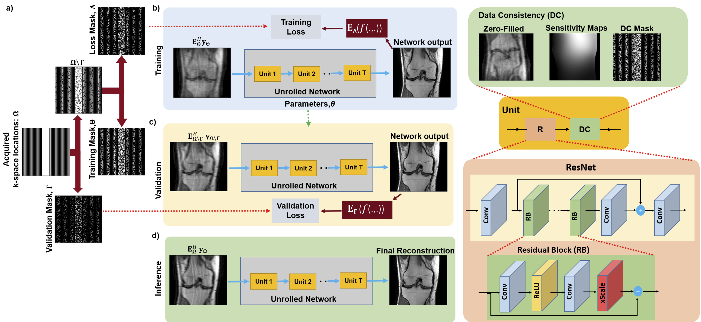

# ZS-SSL: Zero-Shot Self-Supervised Learning
:triangular_flag_on_post:**PyTorch**: This is the pytorch implementation of ZS-SSL in the following ICLR paper: [Zero-Shot Self-Supervised Learning for MRI Reconstruction](https://openreview.net/forum?id=085y6YPaYjP).  

:triangular_flag_on_post:**Tensorflow**: For  tensorflow (original) implementation please visit ([zs-ssl-tensorflow-implementation](https://github.com/byaman14/ZS-SSL)).

:triangular_flag_on_post: If you find our work is helpful for you, please star this repo and [cite](#citelink) our paper 

## ZS-SSL Overview
ZS-SSL enables physics-guided deep learning MRI reconstruction using only a single slice/sample ([paper](https://openreview.net/forum?id=085y6YPaYjP)).
Succintly, ZS-SSL  partitions the available measurements from a single scan into three disjoint sets. Two of these sets are used to enforce data consistency and define loss during training for self-supervision, while the last set serves to self-validate, establishing an early stopping criterion. In the presence of models pre-trained on a database with different image characteristics, ZS-SSL can be combined with transfer learning (TL) for faster convergence time and reduced computational complexity.

 <br>

*An overview of the proposed zero-shot self-supervised learning approach. a) Acquired
measurements for the single scan are partitioned into three sets: a training (Θ) and loss mask (Λ) for
self-supervision, and a self-validation mask for automated early stopping (Γ). b) The parameters,
θ, of the unrolled MRI reconstruction network are updated using Θ and Λ in the data consistency
(DC) units of the unrolled network and for defining loss, respectively. c) Concurrently, a k-space
validation procedure is used to establish the stopping criterion by using Ω\Γ in the DC units and Γ
to measure a validation loss. d) Once the network training has been stopped due to an increasing
trend in the k-space validation loss, the final reconstruction is performed using the relevant learned
network parameters and all the acquired measurements in the DC unit.*

---

## **New Extensions: Frequency Curriculum & UFLoss**

This repository has been extended to support several robust training enhancements:

### 1. Frequency Curriculum Training
Instead of calculating the loss uniformly across k-space from the start, we progressively reveal higher frequencies over time. This acts as a curriculum learning technique, stabilizing the self-supervised training phase. 
- Enable via `--use_frequency_curriculum`
- The `K` (width of the initial center crop) expands incrementally throughout training based on `--frequency_curriculum_decay`.

### 2. UFLoss (Unsupervised Feature Loss)
To enhance high-frequency detail and edge sharpness, an Unsupervised Feature Loss network can be integrated into the objective function alongside the standard L1 loss.
- Provide the path to the UFLoss checkpoint via `--ufloss_path <path/to/checkpoint>`
- Control the weighting of the loss via `--ufloss_weight` (e.g., `0.5`).

### 3. Early Stopping on Validation Delta (Delta-ES)
In addition to stopping when validation loss stops decreasing, we've implemented early stopping based on the **difference** between training loss and validation loss, ensuring the model doesn't overfit to the self-supervised masks.
- Enable via `--stop_on_validation_delta`
- Adjust strictness with `--delta_es_tightness` (higher = stops sooner, less prone to overfitting).

---

## Installation
Dependencies are given in environment.yml. A new conda environment can be installed with
```
conda env create -f environment.yaml
```

## Datasets
We have used the [fastMRI](https://fastmri.med.nyu.edu/) dataset in our experiments.

## How to use

### End-to-End Evaluation Pipeline
We provide a convenient bash script to run the Baseline, Frequency Curriculum, and UFLoss methods sequentially on a single `.mat` file:

```bash
./run_single_test.sh data/path_to_your_scan.mat
```
This script will automatically format the output directories and run the three configurations side-by-side.

### Visualizing Reconstructions & Metrics
Once a test sequence completes, you can visualize and compare the final reconstructions side-by-side using the automated plotting script:

```bash
python plot_best_recons.py --base_dir saved_models_file_brain_... --data_file data/path_to_your_scan.mat
```
This generates a cleanly formatted `all_models_recons_comparison.png` displaying the Target, Baseline, Frequency Curriculum, and UFLoss reconstructions along with x10 boosted error maps. A zoomed ROI plot (`zoomed_recons_comparison.png`) is also automatically generated.

### Plotting Early Stopping Curves
To analyze the validation and loss curves across epochs (including the Delta gap):
```bash
python plot_early_stopping.py --base_dir saved_models_file_brain_...
```
This yields `early_stopping_metrics_plot.png`.

---

### Manual Training
ZS-SSL training and reconstruction can also be performed interactively by running `zs_ssl_recon.ipynb`. Prior to running training file, hyperparameters such as number of unrolled blocks, split ratio for validation, training and loss masks can be adjusted from `parser_ops.py`. If ZS-SSL training has been done, `zs_ssl_inference.ipynb` can be directly used for reconstruction.

We highly recommend the users to set the outer k-space regions with no signal as 1 in training mask to ensure consistency with acquired measurements. Please refer to our [SSDU](https://github.com/byaman14/SSDU) repository for further details.


## Early Automated Stopping
In `parser_ops.py`, we have also defined a parameter (`--stop_training`) to automatically stop the training process. The `--stop_training` parameter denotes the number of consecutive epochs without achieving a lower validation loss (to disable early automated stopping, set `--stop_training` to  the number of epochs). 

## <span id="citelink">Citation</span>
If you find the codes useful in your research, please cite
```
@inproceedings{
yaman2022zeroshot,
title={Zero-Shot Self-Supervised Learning for {MRI} Reconstruction},
author={Burhaneddin Yaman and Seyed Amir Hossein Hosseini and Mehmet Akcakaya},
booktitle={International Conference on Learning Representations},
year={2022},
url={https://openreview.net/forum?id=085y6YPaYjP}
}
```

## Copyright & License Notice
© 2021 Regents of the University of Minnesota

ZS-SSL is copyrighted by Regents of the University of Minnesota and covered by US 17/075,411. Regents of the University of Minnesota will license the use of ZS-SSL solely for educational and research purposes by non-profit institutions and US government agencies only. For other proposed uses, contact umotc@umn.edu. The software may not be sold or redistributed without prior approval. One may make copies of the software for their use provided that the copies, are not sold or distributed, are used under the same terms and conditions. As unestablished research software, this code is provided on an "as is'' basis without warranty of any kind, either expressed or implied. The downloading, or executing any part of this software constitutes an implicit agreement to these terms. These terms and conditions are subject to change at any time without prior notice.

## Questions
If you have questions or issues, please open an issue or reach out to me at yaman013 at umn.edu .
